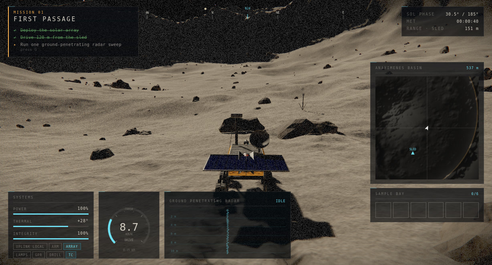
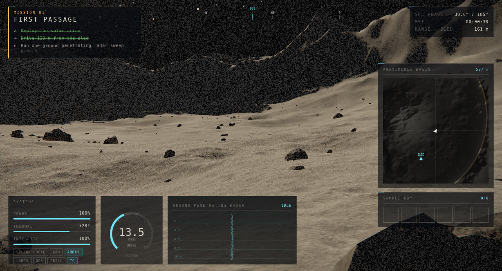
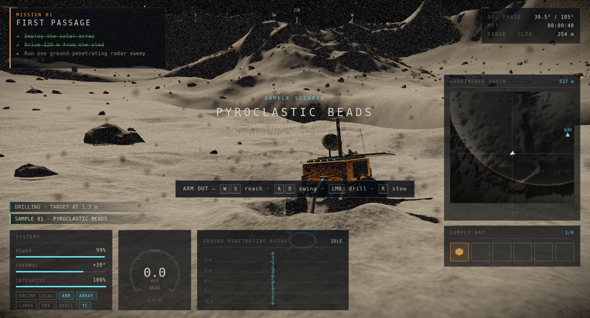
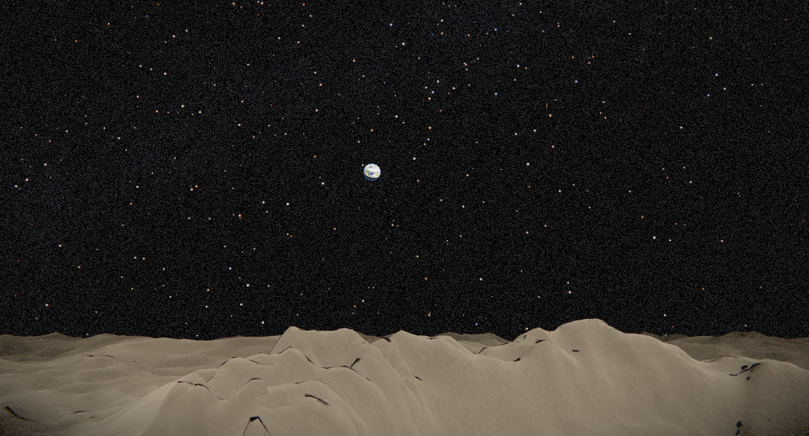
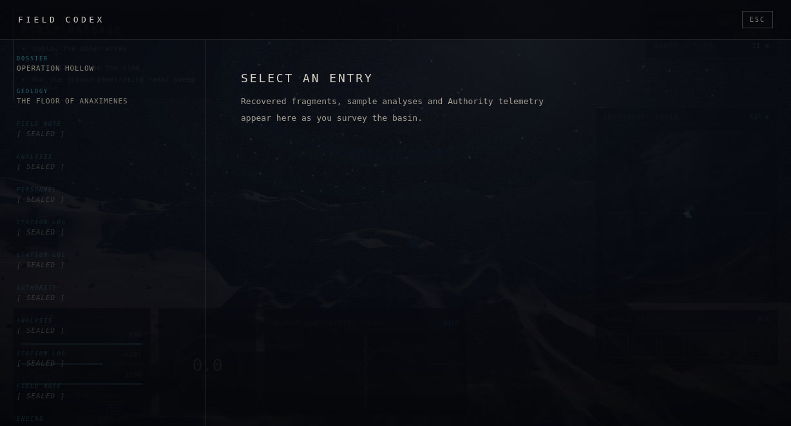
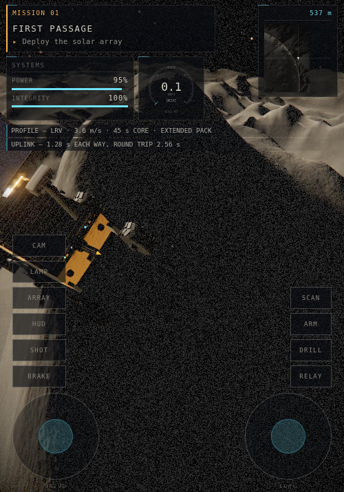
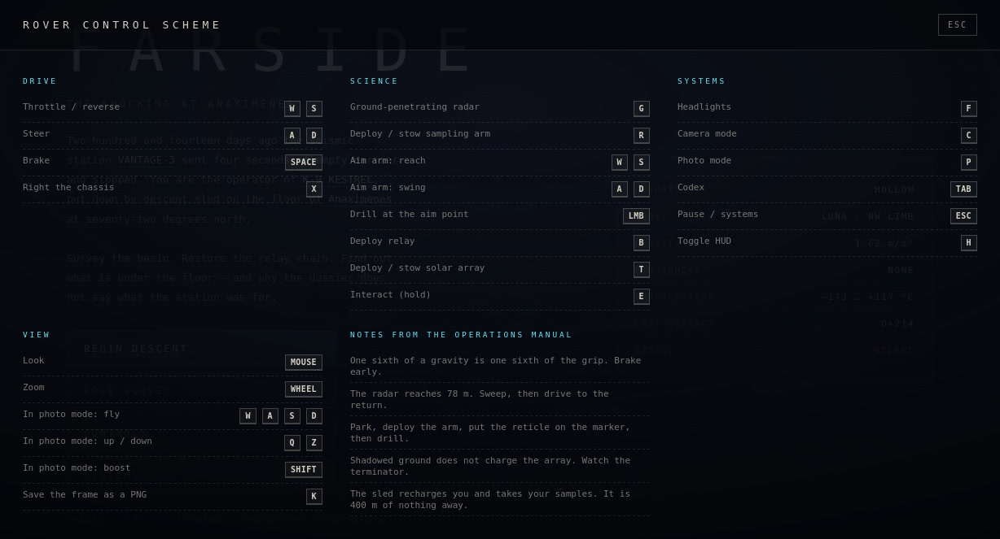
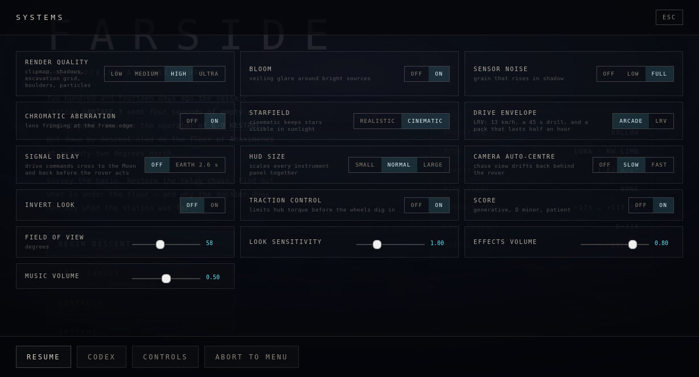

<div align="center">

# FARSIDE

### Four campaigns on three moons

**A rover survey game that runs in a browser tab — the far side of the Moon,
Ganymede and Callisto.**
No engine, no build step, no `npm install`, no asset files.
One vendored library: three.js.


-1a1d24)




</div>

> Two hundred and fourteen sun-days ago the deep-seismic line at **VANTAGE-3**
> went quiet — the floor stopped knocking.
>
> You operate **K-9 KESTREL**, a 900 kg six-wheel survey rover put down by
> descent sled on the floor of Anaximenes at 72° north. Survey the basin,
> restore the relay chain, and find out what is under the floor — and why it
> began again the day you landed.

---

## The survey zones

Anaximenes is the first of four. The menu puts the rest behind the same rover —
a second lunar basin and two moons of Jupiter, each with its own sky, its own
gravity, its own five-mission campaign and its own ending:

| zone | body | the campaign |
|:--|:--|:--|
| **ANAXIMENES** · *The Knocking at Anaximenes* | Moon · 72° N, NW limb | The seismic line under the basin floor went quiet and the relay chain is down. **FIRST PASSAGE → THE LISTENING FLOOR → OPEN CHANNEL → THE QUIET STATION → THE KNOCK** end in **COUNTING** — when the floor's answer comes back over the uplink. |
| **THE LONG SHADOW** · *Operation Hollow II* | Moon · high-rim basin | In through a breach in the rim: a post whose log ends mid-sentence, an array hub nine metres underground, and a last uplink that is a count, not a message. **THE LONG SHADOW → ECHO → THE QUIET ONE → SILENCE → THE COUNT.** |
| **THE CHOS PLAIN** · *The Plain That Rings* | Ganymede · highland plain | A far sun five times smaller than the Moon's, crawling between 0.6° and 6.5° and never setting, Jove at ~7° across and three Galilean dots to sit under, and a plain that answers a radar sweep as one single membrane — the 2.2 m resonant lining under the rise is the shallowest core in the game. **THE DARK PLAIN → THE FIRST ENTRY → THE RING → THE LONG DRIVE → THE ARRIVAL.** |
| **CONAMARA** · *The Breakout Field* | Callisto · dark floor | Impact-flash-pocked ground over a lattice of hollow pipes, and the game's first real night: the sun dips below the horizon, the pack stops charging, and one objective runs by headlight. **THE DARK FLOOR → THE FIELD → THE DEAD TAP → DUSK → THE EVENT.** |

Each zone is a pure-data record in the engine — terrain parameters, gravity,
sun curve, sky, albedo, dust colour, content and missions —
[the technical side](#the-technical-side) covers it. Saves are per-zone
`localStorage` slots, so all four campaigns run side by side in one tab, and
the menu's status line for a zone is that zone's own save state. Once a
campaign ends there is a free survey — drive, sweep, drill, no mission.

---

## Look at it

|  |  |
|:--|:--|
|  <br> **Mast cam.** The full instrument set in one field of view, parked at the end of the first drive. The GPR scope is idle here — a 400 MHz sweep draws its wavefront into the terrain's own shading rather than laying it over, and returns buried objects as positions and depths you then have to drive to. |  <br> **Drilling.** The arm is a two-link IK chain you aim yourself. Every core comes out of the height field the wheels drive on. |
|  <br> **Earth never gets high.** At 72° north it sits 13°–16° up — from the basin floor the rim wall is in the way. That is why the relay mission exists. |  <br> **The codex** fills in as you survey. Twelve entries, most of them sealed until you have been somewhere or drilled something. |

<div align="center">


*On a phone the instrument list is cut to what you steer by, and the bottom of the screen belongs to your thumbs.*

</div>

---

## About this project

It is not a finished game. It *is* a real one: four campaigns of five missions,
an ending for each — and a rover that will dig itself a 48 cm hole if you sit
there with the throttle down: deeper than its own axle line, and there is no
rescue mechanic for it.

There are **no downloaded assets**, and the game fetches none at runtime — not
even a failed request. Every texture, every rock, every star and every sound is
generated by code at load time — partly a design constraint, partly the reason
the whole thing is ~410 KB over the wire and loads in seconds.

| | |
|--:|:--|
| **8,392** | lines of JavaScript in `src/` |
| **622** | lines of CSS |
| **0** | npm dependencies, build steps, and asset files the game loads |
| **20** missions · **4** endings · **30** codex entries · **16** sample types | across the four zones |
| **~410 KB** | gzipped download (1.75 MB raw), including a vendored three.js |

---

## Play

It is a static site with nothing to install — any web host, or the local
server below.

Chrome/Edge 89+, Firefox 108+, Safari 16.4+, iOS 16.4+. It needs WebGL2 and —
because there is no build step — native **import maps**, and it is the import
map rather than WebGL2 that sets those floors. Works on phones and tablets with
twin thumbsticks. Progress autosaves to a per-zone `localStorage` slot every
20 seconds.

### Run it locally

```bash
npm start
```

Then open <http://localhost:5173>. Any static file server works — the only
requirement is HTTP rather than `file://`, because it uses ES modules.

```bash
node server.js 8080
```

Node 18+ for the server. There is nothing to install; `npm start` just runs
`server.js`, which has no dependencies either.

### Publish your own

It is a static site with no build step, so GitHub Pages needs nothing special:
push the repo, then **Settings → Pages → Source: Deploy from a branch**, `master`
and `/ (root)`. Every path is relative, so it works from a subdirectory without
configuration.

---

## Controls

| | |
|---|---|
| `W` `S` | Throttle / reverse |
| `A` `D` | Steer — and pivot on the spot when stopped |
| `Space` | Brake |
| `X` | Right the chassis after a rollover |
| `G` | Ground-penetrating radar sweep (78 m) |
| `R` | Deploy / stow the sampling arm |
| `W` `S` `A` `D` | With the arm out: reach and swing it |
| `LMB` | Drill at the aim point |
| `B` | Deploy relay |
| `T` | Deploy / stow the solar array |
| `E` | Interact (hold) |
| `F` | Headlights |
| `C` | Cycle camera · `P` photo mode |
| `K` | Save the current frame as a PNG |
| `Tab` | Field codex |
| `Esc` | Pause / systems |
| `H` | Toggle HUD |

Mouse looks, wheel zooms. A gamepad drives, steers, brakes and looks, and covers
scan, arm, lamp, relay, camera, codex and pause — but the drill, the solar array,
interact, righting the chassis, photo mode, HUD and the frame grab are still
keyboard and mouse, so a pad is a second controller rather than a complete one.
On phones and tablets you get twin
thumbsticks and two button groups, including `HUD` to clear the instruments off
the screen. They stack as columns beside the sticks — except on a landscape
phone, where they drop into a single row between them.



The chase camera drifts back behind the rover only after you have left the mouse
alone for about three seconds — set **CAMERA AUTO-CENTRE** to OFF under `Esc` if
you would rather it never moved on its own. **HUD SIZE** scales every instrument
panel together.

Two settings make it harder and more honest:

**DRIVE ENVELOPE** swaps the arcade profile for an LRV one: 13 km/h instead of
30, a 45-second core instead of 4, and a pack that lasts about twenty minutes of
hard driving instead of two and a half. Every speed threshold that shapes the
feel — the rover's steering taper, pivot, hill-hold and traction control, the
camera's dolly, field of view and auto-centre, the motor's pitch and the grind
under the wheels — is a fraction of that one top-speed number, so the steering
still loads up, the camera still dollies and the motor still sounds worked; they
just do it at a real rover's pace. (Wheel *slip* is still measured absolutely,
because slip is a relative velocity rather than a road speed.)

The battery is the one number that is deliberately *not* realistic, and it is
worth saying why rather than fudging it quietly. An LRV pack is 8.7 kWh and
about 57 km of range; this basin is 864 m across, so a real pack would cross it
sixty-six times. Even VIPER's much smaller 450 Wh is hours. There is no honest
capacity that leaves power as a source of tension at this scale — so realistic
mode does not invent one. It slows the drain eightfold, which turns power from a
panic into planning, and moves the pressure to time, where the slow drive, the
slow drill and the signal delay already put it.

**SIGNAL DELAY** puts you where a Lunokhod driver actually sat. Drive commands
cross to the Moon and the picture comes back: 1.28 s each way, 2.56 s before you
see the rover do what you told it. Measured in-game, at LRV speed, releasing the
throttle costs you **21 m of coast instead of 11** — you brake three rover
lengths earlier than feels right, or you hit the boulder you already stopped for.
Arm aiming and the camera are deliberately not delayed; that is a playability
call, not a claim about physics, and the reasoning is in `main.js`.



*Both realism settings switched on: the LRV drive profile and the Earth round trip.*

---

# The technical side

Everything below is in this repository, in plain ES modules you can open and
read. The interesting parts are not the rendering tricks — they are the places
where the physics and the pixels are forced to agree.

## The zones are data, the engine is one

The four survey zones live in one module — `src/game/regions.js` — as
pure-data records. A record carries the terrain parameter bundle `P`, gravity,
the sun cycle (a rate plus an altitude curve everything else reads off), the
sky configuration (the Earth disc, or Jove: angular size, companion points,
sun-disc scale, star seed, IBL ground bounce), the ground albedo seeds and
tint, the dust palette, and the zone's own landmarks, anomalies, mission
sequence, codex and ending. A zone is not an engine path: the two Moon records
carry none of the Jovian fields and read defaults instead, and the default path
is held bit-exact by a frozen identity check — a pre-parameterisation copy of
the bake math that today's output must match to strict float equality, plus
two-bake determinism; the two Jovian bundles ride on the same in-page
double-bake discipline.

Switching zones from the menu tears down exactly what the world builder owns —
terrain, props, dust, rover, camera, sky, in reverse — and rebuilds it from the
next record. The boot singletons (renderer, audio, input, HUD, the texture
cache) are never re-created, and a per-zone albedo memo means swapping out and
back never regenerates a world. Saves are per-zone slots, so four campaigns
run side by side in one profile.

## What is actually simulated

### A sixth of a gravity, and the consequences

Each zone carries its own `g` — 1.62 on the Moon, 1.428 on Ganymede, 1.236 on
Callisto — and the rover and the dust both integrate against the zone's number.
The suspension is sized for **lunar** weight — 1458 N total, about 9 cm of
static sag — so the same chassis sags proportionally less and floats a little
longer where the gravity is weaker. Earth spring rates would make the rover act
like a steel bar; the first version used them and it did. Peak traction is
roughly 1250 N at lunar weight, so the rover accelerates at about 1.3 m/s² and
lets go of the surface long before you expect it to.

### Wheels, not a capsule

A rigid body with a real inertia tensor and six raycast wheels, each with
spring-damper suspension, slip-based tyre forces inside a friction circle, and
pressure-based sinkage — a saturating linear model, not a true Bekker
pressure-sinkage curve. Contact pressure over the bearing strength of the top
few centimetres of regolith (~12 kPa) gives 1–2 cm of sink at static load and
about 6 % of weight in rolling resistance, which is roughly what Apollo
measured.

The wheel-spin integration is solved **semi-implicitly**, because the hub's
inertia is tiny next to the slip stiffness and an explicit step oscillates and
then explodes:

```js
spinNew = (w + dt*aT + dt*K*R*vLong/I) / (1 + dt*K*R*R/I)
```

### A rut, not a decal

The wheels cut real geometry into the height field **the physics reads back**:
a ~10 cm trough per side with the displaced regolith piled into berms along both
flanks, so the track catches raking light and throws its own shadow.

Spin a wheel and it stops settling and starts *digging* — hold the throttle down
and you will excavate a hole and drop into it. Turn traction control off first:
it ships on, and backing the hub off before it buries itself is exactly its job.
Compacted rut floor never slumps; churned rut floor creeps back over a couple of
seconds. (Sinkage is a function of wheel load alone — there is no soil map, so
every square metre of the basin digs the same.)

### Ballistic dust

There is no air, so there is no billowing cloud and no settling haze. Every
grain flies a clean parabola under the zone's gravity — gravity is the only
force on it — and lands where the arithmetic says. That single fact is what
makes lunar rooster tails look lunar. One honest limit: a grain is budgeted the
lifetime its own parabola needs over *flat* ground (`2·v/g`, plus half a
second), so one flung out over ground that falls sharply away fades out before
it touches down.

### The photometric function

The surface uses **Lommel–Seeliger** rather than Lambert, which is why the Moon
reads as a flat disc instead of a shaded ball, plus a coherent-backscatter
opposition surge that washes the ground out when you drive down-sun. There is no
air and so no aerial perspective to inherit — which is exactly why lunar
photographs have no sense of scale. The shader keeps an authored falloff past
700 m anyway, down to about a third of full brightness by 3.4 km, purely as a
depth cue: with none at all the rim wall reads as a black cut-out rather than a
mountain.

### Light

Each zone carries its own sun curve; the light below is Anaximenes'. A grazing
sun circles the horizon rather than arcing overhead, bobbing between 17° and 31°
and taking about seventeen minutes of play to come round. Shadows sweep around
you like a sundial. That band is authored, not derived: the Moon's 1.54° axial
tilt caps the real sun near 18° at 72° north, and lets it set every lunation.
A higher sun that never sets is what buys enough light to drive by and a rim
wall that still keeps its own floor dark for hours.

The Jovian curves are authored the same way. On the Ganymede plain the sun
crawls between 0.6° and 6.5° — a dim midday that never quite turns — and on
Callisto it dips to −3.4° below the horizon for better than half an hour. That
is the game's first real night: sun below 0° means the array does not charge,
the SOL PHASE readout goes negative, and one objective is a plain drive across
the dark by headlight.

Crater shadows come from a baked sun-occlusion mask that ray-marches the height
field, with a penumbra sized to the sun's real **0.53° angular diameter** —
which is why lunar shadow edges look like they could cut you.

### Power

A full pack is about two and a half minutes of hard driving through shadow —
nearer two with the lamps on, since below −30 °C the survival heaters come on
too. The array charges only with the sun actually on it, so the panel angle and
your own shadow both count. Parked on the sled you charge regardless, which is
what makes the sled a base rather than a landmark.

Running flat does not strand you, but it is not free either. Hub torque scales
with charge below 25 %, down to a floor of 18 % — enough to limp home, not
enough to climb anything. The radar and the drill are harder gates: both refuse
outright if the pack cannot cover the cycle.

---

## Rendering

### Terrain

At the default HIGH tier, a **nine-level geometry clipmap**: 0.16 m cells under
the wheels out to 41 m cells on an outer ring 6.55 km across — 3.3 km straight
ahead, 4.6 km to the corners — with ~370 k triangles and zero per-frame CPU
geometry work. (ULTRA is also nine levels; MEDIUM is eight and LOW seven, with
proportionally coarser cells.) Heights are baked once on the CPU into R32F textures with a box-filtered
mip chain; each ring samples the mip matching its own cell size.

Without that mip chain the coarse rings interpolate straight across crater bowls
and leave a row of tents on the skyline. R32F rather than half-float because
16-bit quantises height to 12 cm at 160 m, and you can see it. The exception is
a device without `OES_texture_float_linear`: there the chain is never uploaded,
every ring reads mip 0, and the coarse rings alias — the trade for keeping the
surface smooth under the wheels, which is the next section.

### Physics and pixels agree under the wheels

The GPU never re-derives a height. It samples the same baked field the wheels
do, with a CPU bilinear filter written to match GL's. Where
`OES_texture_float_linear` is missing, the shader filters in software rather
than falling back to blocky nearest sampling.

This is the constraint the whole terrain system is built around: if the two
disagree where the rover is standing, it floats or sinks, and no amount of
tuning fixes it.

Farther out they are allowed to part company on purpose. Every ring but the
innermost is drawn 10 % of its own cell size low, so the LOD seam falls below
the finer ring instead of poking through it — up to 4 m of deliberate sag on the
41 m ring — and the whole surface is bent down quadratically with distance to
fake a horizon. Neither has a counterpart on the CPU. Nothing drives out there,
so nothing notices.

### Excavation

A 4096² field at 0.25 m per texel on HIGH and ULTRA (2048² and 0.5 m on LOW and
MEDIUM), spanning ±512 m so the whole crater interior and rim crest sit inside
it, CPU-authoritative and uploaded as small dirty rects. Only the touched rectangles are re-uploaded,
tracked as region lists rather than a growing union — the union version reached
1.7 M cells and 62 ms/frame before it was replaced.

The grid is sized by the quality tier, so changing tier has to move it. It is
resampled rather than cleared: the field holds your own ruts and drill pits, and
throwing them away on a settings change would be the worse bug. A 4096 → 2048
step costs about 2 mm of rut depth, which is the honest price of halving the
grid and does not compound while you stay put.

### Boulders

Instanced, with a triplanar procedural surface: mottled plagioclase, chipping
normals that fade with distance so pebbles do not alias, and regolith dust
settling on every up-face.

The field is always scattered at the densest tier's count and the lower tiers
draw a prefix of it, so a boulder is in the same place at every setting. The
alternative — re-rolling the scatter per tier — slides rocks around a player who
is driving between them, and a boulder is a collider, not just a sprite. What
the tier hides is also un-collided, so nothing invisible can stop you.

### Post

Linear HDR through the composer, bloom, ACES, and a final pass that treats the
image as what it is in fiction — a camera bolted to a rover, with sensor noise
that rises in shadow and a veiling glare toward the sun.

### Performance

The framebuffer is capped by **total pixel count**, not by device pixel ratio.
This matters more than it sounds: a Retina MacBook reports `devicePixelRatio` 2,
so the obvious `setPixelRatio(dpr)` on a 1710-point-wide window renders
3420×2136 — **7.3 megapixels**
through a shader that ray-marches and triplanar-samples. Capping pixels instead
brings that to 2.4 Mpx while still rendering above native CSS resolution.

```js
let px = Math.min(devicePixelRatio, quality.maxDpr);
const over = (w * h * px * px) / quality.pixels;   // pixels, not ratio
if (over > 1) px /= Math.sqrt(over);
```

On top of that a governor watches a rolling frame time and trades resolution for
smoothness between 100 % and 62 % before you notice, giving it back when there is
headroom. A quality tier is guessed once from the device — reported memory and
core count, with a touch screen costing one tier rather than pinning you to the
bottom — and everything else follows from it: clipmap density, shadow map size,
MSAA, the excavation grid, the trail and sun-mask buffers, boulder density and
the dust budget.

Changing it under `Esc` re-fits all of them live. That costs 11–16 ms, or
130–310 ms when the excavation grid has to change size and be resampled.
Nothing re-bakes the basin — the height field does not depend on the tier, so
the expensive half of the load is reusable, which is the only reason a tier
change can be a hitch rather than a reload. MSAA stays off above 3.2 Mpx of
framebuffer whatever the tier asks for.

---

## The HUD on a small screen

Every instrument dimension is a multiple of **one CSS variable**, so the whole
panel set scales from a single knob and keeps its proportions instead of forty
pixel values drifting apart. Instrument type carries a floor the scale cannot
push through: shrinking the HUD takes space off canvases, bars and padding,
never off the labels you steer by.

```css
.hud { --u: 1px; --s: calc(var(--u) * var(--hud-k)); }
.sys { width: calc(214 * var(--s)); }
.gauge label { font-size: max(8px, calc(8.5 * var(--s))); }
```

Scaling alone stops working somewhere around tablet size. A 390 px screen cannot
carry mission control at any size you can still read — shrink far enough and you
have six panels of 6 px type covering half the view. So **phones drop
instruments instead**, and the survivors get the room: objective, speed, power,
integrity, map. The scale unit goes *up* from the tablet's and the type with it,
while the canvases go the other way — the map is cut to a little over half its
tablet width — which is how five panels still fit a 390 px screen.

The compass strip, sample bay, thermal, status chips, wheel monitor, radar scope
and the mission clock are reference readouts nobody reads mid-corner, so on a
phone they are cut outright. Be clear about the cost: they do not move to the
pause panel, which is settings, and nothing else brings them back. In landscape
the speed dial goes too — there is no room for it.

The other rule is that **thumbs own the bottom of the screen**. From tablet size
up the HUD moves above the sticks, keyed on a class set by the code that
actually mounts them rather than a `pointer: coarse` media query, since those
two can disagree and the question that matters is whether there are thumbsticks
on screen right now. Phones do not need the hook: at that width the HUD is on
the top edge on the breakpoint alone, and the class-keyed blocks are bounded
away from it so exactly one layout wins per device.

A landscape phone is short rather than narrow, and it is the case that breaks
every assumption. The HUD runs along the top edge there instead of stacking, and
the **buttons stop being columns**: five stacked buttons plus a stick is 300 px
of a 370 px screen, so the columns climbed the left and right edges straight
into the mission panel and the map. They become a single row along the bottom,
in the dead strip between the two sticks, which hands the entire top of the
screen back to the HUD.

| viewport | HUD coverage | smallest type |
|---|--:|--:|
| 393 × 852 · phone | 22 % | 8.6 px |
| 932 × 370 · phone, landscape | 27 % | 8.5 px |
| 375 × 667 · small phone | 34 % | 8.6 px |
| 820 × 1180 · tablet | 18 % | 8.0 px |
| 1180 × 820 · tablet, landscape | 28 % | 8.0 px |
| 1440 × 900 · desktop | 26 % | 8.0 px |

---

## Audio

Nothing carries sound out there. What you hear is what the chassis carries, so
all of it is structure-borne and dull; the only bright things in the mix are
electrical — the radio, the GPR chirp, the alarms. Everything is synthesised at
runtime and there are **no audio files**.

The motor is one band-limited pulse train — a commutating hub — fed through a
bank of **fixed** resonators standing in for the chassis, at 172 / 418 / 905 Hz.
That split is what makes it read as a machine rather than a siren: the
excitation pitch rides the wheel speed while the body formants stay exactly
where they are, and load opens the upper ones.

Regolith is granular, because gravel is not a filtered hiss — it is thousands of
separate impacts. A quiet bed carries the body and individual grains are
scattered on top at a rate set by wheel speed and slip, each with its own pitch,
filter and stereo position.

---

## Layout

```
index.html          shell, boot screen, HUD markup
server.js           zero-dependency static server
src/
  main.js           bootstrap, region swap, loading, frame loop   962
  core/
    engine.js       renderer, composer, pixel budget, quality     295
    input.js        keyboard / mouse / gamepad / touch            207
    audio.js        procedural WebAudio                           427
    rng.js          deterministic noise shared by CPU and bake     81
    save.js         per-zone localStorage slots                    44
  world/
    terrain.js      clipmap, excavation, trails, sun mask        961
    bake.js         worldgen math, one parameter bundle per zone  325
    props.js        boulders, sled, VANTAGE-3, posts, relays,
                    breakouts                                    844
    sky.js          stars, sun, Earth, Jove, IBL                 553
    dust.js         ballistic regolith                           217
    textures.js     procedural body albedos, Jove                200
  game/
    rover.js        the machine and its physics                  920
    gameplay.js     radar, drill, power, mission state           685
    regions.js      every world as data: one record per zone     723
    lore.js         codex, samples, the Anaximenes campaign      220
    content.js      landmarks, world content, mission gates       20
    camera.js       chase / orbit / mast / photo                 179
  ui/
    hud.js          instruments, minimap, codex                  529
    styles.css      scale system, three-row HUD grid, responsive 622
vendor/three/       three.js r160 + one addon (MIT)
docs/               the screenshots in this README
```

## Development

`node server.js 5173 --shots` adds a `POST /__shot?n=<name>&ext=<ext>` endpoint
that writes an image into `.shots/` — used to capture frames while testing. Off
by default; the release server accepts no writes of any kind.

`window.FARSIDE` exposes the running app, plus `FARSIDE.tick(dt)` to advance a
single frame by hand — which is how every screenshot in this README was taken,
and how the demo video was rendered.

The demo's soundtrack is not a screen recording. Nothing here plays back an
audio file, so there was nothing to record: the capture pass wraps
`audio.update()` and logs the exact parameters the live engine receives on every
frame, plus each one-shot and the frame it fired on. The whole graph is then
rebuilt on an `OfflineAudioContext` and replayed against that log. An offline
context's `currentTime` does not advance while you schedule against it, so
`Audio` takes an explicit `timeBase` and every scheduling site reads `now()`
rather than the context clock. Picture and sound come out of the same
deterministic pass, which is why the motor pitch tracks wheels you can watch
turning.

## Licence

`vendor/three/` is [three.js](https://threejs.org) r160, MIT, copyright the
three.js authors.

There are no other third-party assets. Every texture and every sound is
generated at runtime by code in this repository.

<div align="center">
<br>

*"Shadows here do not shorten at midday. They only turn."*

</div>
